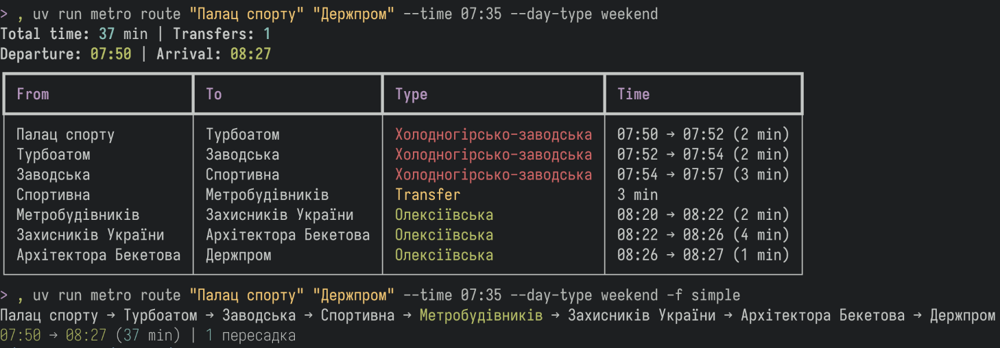

# Kharkiv Metro Route Planner

CLI та MCP сервер для планування маршрутів у Харківському метрополітені.



## Запуск та ініціалізація бази даних

Проєкт використовує `uv`, наступні команди виконуються через `uv run metro`.

**Автоматична ініціалізація** (при першому запуску будь-якої команди):
```bash
metro route "Холодна гора" "Героїв праці"
# Автоматично створить конфіг та базу в XDG директоріях
```

**Ручна ініціалізація**:
```bash
metro init
```

## Конфігурація

Конфіг зберігається в XDG директоріях:
- **Linux**: `~/.config/kharkiv-metro-rp/config.toml`
- **macOS**: `~/Library/Application Support/kharkiv-metro-rp/config.toml`
- **Windows**: `%APPDATA%\kharkiv-metro-rp\config.toml`

База даних:
- **Linux**: `~/.local/share/kharkiv-metro-rp/metro.db`
- **macOS**: `~/Library/Application Support/kharkiv-metro-rp/metro.db`
- **Windows**: `%LOCALAPPDATA%\kharkiv-metro-rp\metro.db`

### Формат config.toml - повна специфікація

#### `[database]` - налаштування бази даних

| Опція | Тип | За замовчуванням | Опис |
|-------|-----|------------------|------|
| `auto` | boolean | `true` | `true` - використовувати XDG директорію, `false` - використовувати `path` |
| `path` | string | `null` | Абсолютний шлях до бази даних (використовується якщо `auto = false`). Підтримує `~` (домашня директорія) |

**Приклади:**
```toml
# Варіант 1: XDG (рекомендовано)
[database]
auto = true

# Варіант 2: Кастомний шлях
[database]
auto = false
path = "~/Documents/metro.db"

# Варіант 3: Абсолютний шлях
[database]
auto = false
path = "/var/lib/kharkiv-metro/metro.db"
```

#### `[preferences]` - загальні налаштування

| Опція | Тип | За замовчуванням | Можливі значення | Опис |
|-------|-----|------------------|------------------|------|
| `language` | string | `"ua"` | `"ua"`, `"en"` | Мова станцій за замовчуванням |
| `output_format` | string | `"table"` | `"table"`, `"json"` | Формат виводу за замовчуванням для `stations` та `schedule` команд |

#### `[preferences.route]` - налаштування маршрутів

| Опція | Тип | За замовчуванням | Можливі значення | Опис |
|-------|-----|------------------|------------------|------|
| `format` | string | `"full"` | `"full"`, `"simple"`, `"json"` | Формат виводу маршруту: full=детальна таблиця, simple=компактний inline, json=JSON |

**Приклади:**
```toml
[preferences]
language = "en"           # Англійська мова
output_format = "table"   # Таблиця для stations/schedule

[preferences.route]
format = "simple"         # Компактний вивід для route команди
output_format = "json"    # JSON формат замість таблиць
```

#### `[scraper]` - налаштування парсера сайту

| Опція | Тип | За замовчуванням | Опис |
|-------|-----|------------------|------|
| `timeout` | integer | `30` | Таймаут HTTP запитів в секундах |
| `user_agent` | string | `"kharkiv-metro-rp/1.0"` | User-Agent для HTTP запитів |

**Приклади:**
```toml
[scraper]
timeout = 60                          # Збільшити таймаут для повільного інтернету
user_agent = "MyBot/1.0"              # Кастомний User-Agent
```

### Повний приклад config.toml

```toml
[database]
auto = true

[preferences]
language = "ua"
output_format = "table"

[preferences.route]
format = "full"

[scraper]
timeout = 30
user_agent = "kharkiv-metro-rp/1.0"
```

### Команди управління конфігом

```bash
# Показати поточний конфіг зі шляхами
metro config show

# Змінити мову (ua/en)
metro config set preferences.language en

# Змінити формат виводу для stations/schedule (table/json)
metro config set preferences.output_format json

# Змінити формат маршруту (full/simple/json)
metro config set preferences.route.format simple

# Змінити режим бази даних (true/false)
metro config set database.auto false

# Встановити кастомний шлях до бази
metro config set database.path "~/metro.db"

# Змінити таймаут скрейпера (в секундах)
metro config set scraper.timeout 60

# Змінити User-Agent
metro config set scraper.user_agent "MyBot/1.0"

# Відкрити конфіг у дефолтному редакторі
metro config open

# Скинути всі налаштування до дефолтів
metro config reset
```

**Примітки:**
- Команда `metro config set` працює для будь-якої опції з config.toml за шаблоном `section.key value`. Тип значення визначається автоматично (string, boolean, integer).
- Команда `metro config open` відкриває конфіг у системному редакторі:
  - **Linux**: використовує `xdg-open` або `$EDITOR` (fallback: nano)
  - **macOS**: використовує `open`
  - **Windows**: використовує `start`

### Override XDG шляхів

```bash
# Кастомна база даних
metro --db-path /tmp/test.db route "Холодна гора" "Героїв праці"

# Кастомний конфіг
metro --config ./my-config.toml route "Холодна гора" "Героїв праці"
```

## Пошук маршруту

```bash
# За замовчуванням - з поточного часу
metro route "Холодна гора" "Героїв праці"

# З конкретним часом
metro route "Холодна гора" "Героїв праці" --time "08:30"

# З виведенням у JSON
metro route "Холодна гора" "Героїв праці" --output json

# Англійською мовою
metro route "Kholodna Hora" "Heroiv Praci" --lang en
```

### Перегляд розкладу

```bash
# Розклад станції
metro schedule "Майдан Конституції"

# З конкретним напрямком
metro schedule "Майдан Конституції" --direction "Індустріальна"

# У вихідні
metro schedule "Майдан Конституції" --day-type weekend
```

### Список станцій

```bash
# Всі станції
metro stations

# Тільки одна лінія
metro stations --line saltivska

# Або коротше
metro stations -l s # або "k", "o"
```

### Оновлення розкладів з сайту

```bash
# Заповнити розклади (потрібно ~5-10 хвилин)
metro scrape

# Перестворити базу та заповнити розклади
metro scrape --init-db

# JSON формат виводу
metro scrape --output json
```

Розклади парсяться з https://www.metro.kharkiv.ua/ і зберігаються окремо для буднів та вихідних.

## MCP Server

Запуск MCP сервера для інтеграції з AI-агентами:

```bash
metro-mcp
```

### OpenCode
Передбачає:
- Наявність `uv` у `$PATH`
- Локальний репозиторій
  - `git clone https://github.com/beauloxe/kharkiv-metro-rp.git /foo/bar/`, де `/foo/bar/` - приклад директорії.

```json
"mcp": {
    "metro-kh": {
        "enabled": true,
        "type": "local",
        "command": [
        "uv", "run",
        "--directory", "/foo/bar/kharkiv-metro-rp",
        "python", "-m", "kharkiv_metro_rp.mcp.server"
        ],
    }
}
```

### Доступні інструменти

- `get_route` - пошук маршруту між станціями
- `get_schedule` - отримання розкладу станції
- `list_stations` - список всіх станцій
- `find_station` - пошук станції за назвою

## Структура проєкту

```
metropoliten/
├── src/metropoliten/
│   ├── core/           # Ядро системи
│   │   ├── models.py   # Моделі даних
│   │   ├── graph.py    # Граф метро
│   │   └── router.py   # Алгоритми маршрутизації
│   ├── data/           # Робота з даними
│   │   ├── database.py # SQLite база
│   │   ├── scraper.py  # Парсер сайту metro.kharkiv.ua
│   │   └── initializer.py # Ініціалізація бази
│   ├── cli/            # CLI інтерфейс
│   │   └── main.py     # Команди
│   ├── mcp/            # MCP сервер
│   │   └── server.py   # Сервер
│   └── config.py       # XDG конфігурація
└── data/
    └── metro.db        # База даних (legacy, тепер в XDG)
```

## Особливості

- **3 лінії метро:** Холодногірсько-заводська, Салтівська, Олексіївська
- **3 пересадки:** Майдан Конституції ↔ Історичний музей, Спортивна ↔ Метробудівників, Університет ↔ Держпром
- **Час пересадки:** 3 хвилини
- **Розклад:** Окремий для буднів та вихідних
- **Мови:** Українська та англійська

## Ліцензія

MIT

## TODO
- [ ] Переклад усіх полів
- [ ] Правильна транслітерація та назви станцій
- [ ] Уніфікація виводу, аргументів
- [ ] Переписати весь цей ШІ слоп
